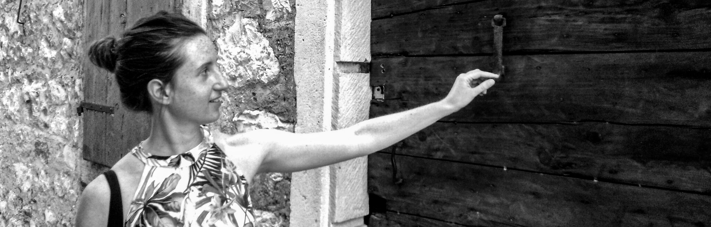

<h1 class="post-title">Dobrodošli! Welcome!
</h1>
 

 

 

I am an assistant professor of [computational linguistics at University of Oregon](https://humanities.uoregon.edu/linguistics). 

My broad academic interest is in understanding *how* sound perception happens. This interest comes from the fact that we, humans, are quite good at understanding (and learning) speech. However, the signal carrying it is extremely variable and complex, and often mixed with noise. I use methods from statistics, machine learning/artificial intelligence and neuroscience to describe psychological mechanisms that show how to efficiently extract the information encoded in the sound signal, just like we humans do daily, without ever worrying about it. By using models as my research tool, I am building an artificial part of a human mind with a goal of understanding the underlying and still unexplained cognitive mechanisms.

 
 

| I am looking for an undergraduate research assistant starting in Fall 2026, or later. I am also looking for a graduate student starting in Fall 2027 that would like to work in an intersection between cognitive science and artificial intelligence, with an ephasis on speech modeling. Please see [the official UO Linguistics guidelines to apply to Linguistics program](https://humanities.uoregon.edu/linguistics/apply/graduate-admissions). If you are considering working with me, you are welcome to get in touch via email.

 
<!-- 
 -->
Previously, I spent a year in [Jochen Triesch's lab](https://www.fias.science/en/life-and-neurosciences/research-groups/jochen-triesch/) in collaboration with [Julio Hechavarria](https://www.julio-hechavarria.com/) in Frankfurt to computationally model active attention in bats. I completed my PhD in July 2024 at [University of Maryland](https://umd.edu/) in the [Linguistics department](https://ling.umd.edu/). My work was primarily advised by [Naomi Feldman](http://users.umiacs.umd.edu/~nhf/) and [Bill Idsardi](https://idsardi.wordpress.com/) on modeling processes of cue weighting in humans and machines. I have also continuously been working with [Thomas Schatz](https://thomas.schatz.cogserver.net/) on perceptual implicit memory of speech in infants and adults. 

My Master's degrees are in French Studies and Comparative Literature at the [Faculty of Arts in University of Ljubljana, Slovenia](http://www.linguist.univ-paris-diderot.fr/) and in [Linguistics (Phonetics and Phonology) in University of Paris, France](http://www.linguist.univ-paris-diderot.fr/), where I was advised by [Ewan Dunbar](http://www.linguist.univ-paris-diderot.fr/~edunbar/). My work there was focused on modelling non native speech perception.

<!--   -->

<!-- Outside of research, I enjoy nature, travel, I teach yoga and know way too much about . -->